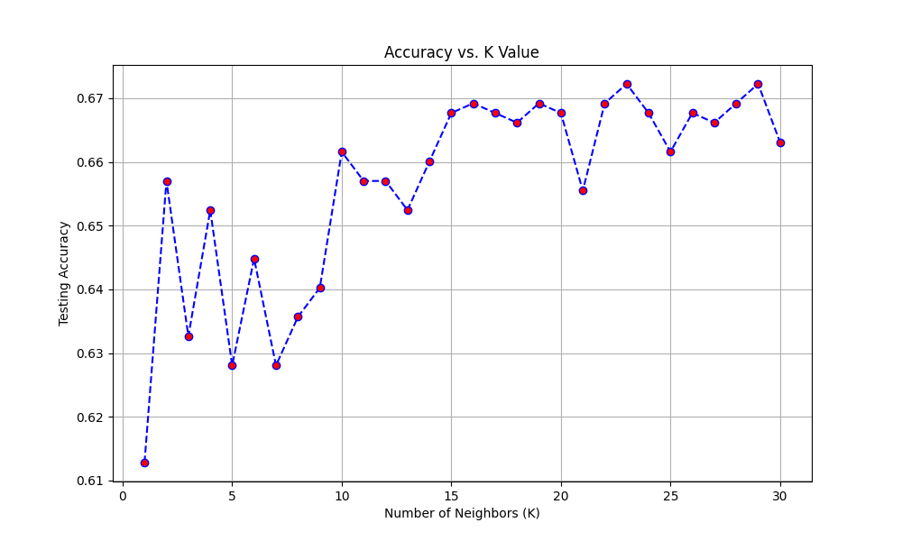
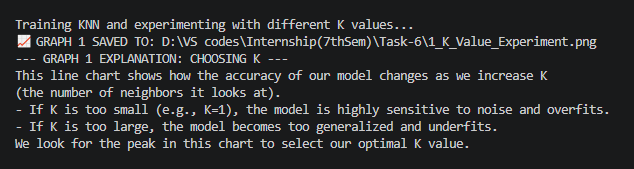
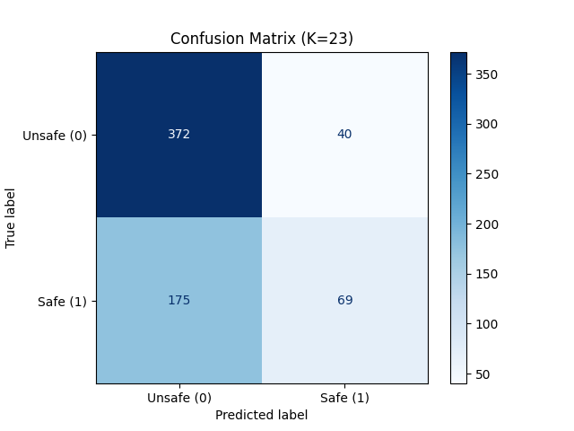
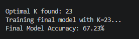
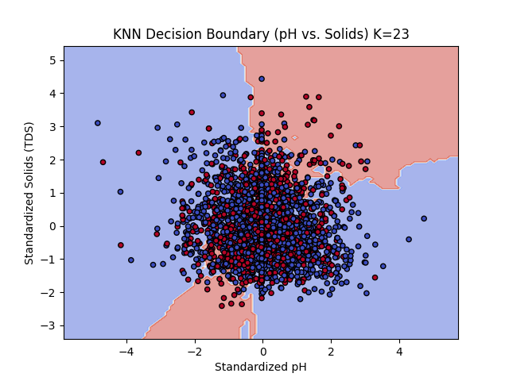
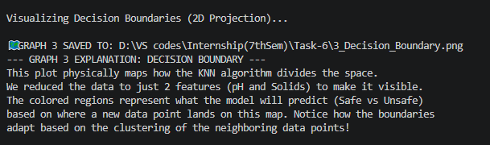

# 🌊 Water Quality and Potability (Environmental Science)

## Project Overview
An end-to-end Machine Learning project utilizing the K-Nearest Neighbors (KNN) algorithm to predict whether a water source is safe to drink based on its chemical makeup. This project highlights the strict necessity of feature normalization for distance-based algorithms, explores hyperparameter tuning to find the optimal 'K' value, and evaluates performance using confusion matrices and 2D decision boundary visualizations.

---

## Pipeline Steps & Key Insights

### 1. Hyperparameter Tuning & Choosing 'K'
Because KNN is a distance-based algorithm, it is highly sensitive to noisy data points. Testing multiple values of K is required to find the perfect balance: a low K overfits to individual noisy water samples, while a high K underfits and over-generalizes.

#### Accuracy vs. K Value
The line chart below illustrates how the model's testing accuracy changes as we increase the number of neighbors (K). We locate the peak in this chart to select the optimal hyperparameter.

#### Model Training & Terminal Output
Below is the terminal log explaining the K-selection process and the model's sensitivity to noise:

---

### 2. Model Evaluation & Confusion Matrix
Using the optimal K value (K=23) discovered in the previous step, a final KNN model was trained and evaluated to see exactly where it succeeds and where it misclassifies safe versus unsafe water.

#### The Confusion Matrix
The matrix below provides a deeper look at the model's performance beyond a flat accuracy percentage. It breaks down the True Negatives (correctly identified unsafe water) and True Positives (correctly identified safe water), as well as the errors.

#### Accuracy & Matrix Terminal Output
Below are the terminal logs confirming the optimal K, the final accuracy score, and the explanation of the matrix grid:

---

### 3. Spatial Decision Boundaries
To visually understand how KNN physically divides the space between safe and unsafe water, the dataset was temporarily projected into two dimensions using just Standardized pH and Standardized Solids (TDS).

#### 2D KNN Decision Boundary
The scatter plot below maps the complex decision regions. The colored background areas represent what the model will predict for a new data point landing in that space, adapting dynamically based on neighboring clusters.

#### Boundary Logic & Terminal Output
Below is the terminal explanation of how the spatial clustering dictates these classification boundaries:

